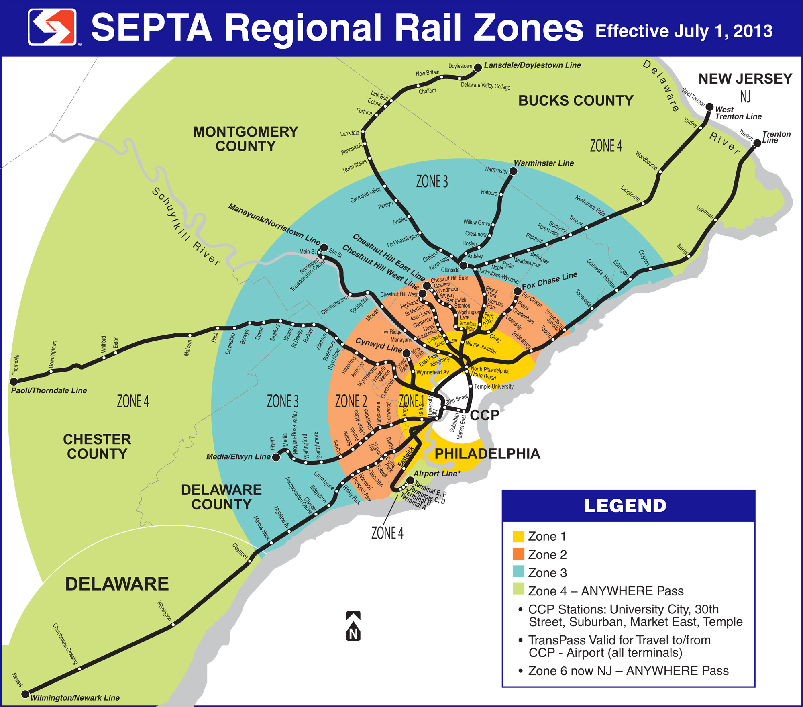
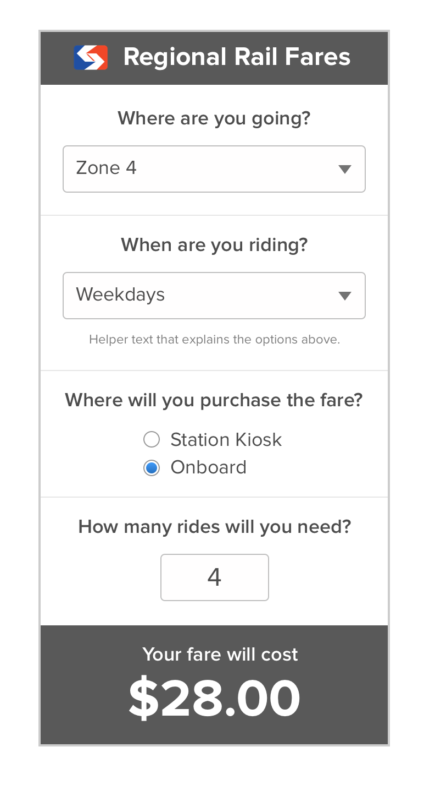

# SEPTA Rail Fare Calculator Challenge

An interactive widget for calculating SEPTA Regional Rail fare prices. (In case you're not familiar with Philadelphia's preeminent mass transit agency, here are all the railroads in map form.)

 

When you take regional rail in and out of the city, the fare price is affected by where you purchase the ticket, when you ride, and how far you travel. You can learn more about the details on [SEPTA's website](http://www.septa.org/fares/ticket/index.html) -- or trust that we've correctly compiled this information into this [JSON file](fares.json). We'd like you to make this information easier to understand by making an interactive fare purchase widget, illustrated in the screenshot below.

## Resources
* [Think Company Development Standards](http://standards.dev.thinkcompany.com)
* [SEPTA Fares](http://www.septa.org/fares/ticket/index.html)
* [SEPTA Logo (SVG)](https://commons.wikimedia.org/wiki/File:SEPTA.svg)
